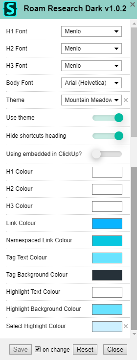

# Roam Research Dark

This is a dark mode theme for [Roam Research](https://roamresearch.com/) with many customisation options.

## Installation

Install [Stylus](https://add0n.com/stylus.html) for either [Firefox](https://addons.mozilla.org/en-US/firefox/addon/styl-us/), [Chrome](https://chrome.google.com/webstore/detail/stylus/clngdbkpkpeebahjckkjfobafhncgmne) or [Opera](https://addons.opera.com/en-gb/extensions/details/stylus/) or [Cascadea for Safari](https://cascadea.app/) and then click the following button:

## Settings

## TODO

- [ ] Write guide on how to use this theme in Roam when embedded in ClickUp
- [ ] Code Block styling
- [ ] Text size customisation
- [ ] Font weight customisation for headings
- [ ] Improve Block `{{embed: ((xyz))}}` styling
- [ ] Improve `/` menu styling
- [ ] Improve `{{alias: ((xyz)) abc}}` styling
- [ ] Improve Date Picker Styling
- [ ] Better Filter styling

## Contributing

Feel free to create issues on this repo or reach out to me on [twitter](https://twitter.com/vandermerwed). Pull requests welcome.
